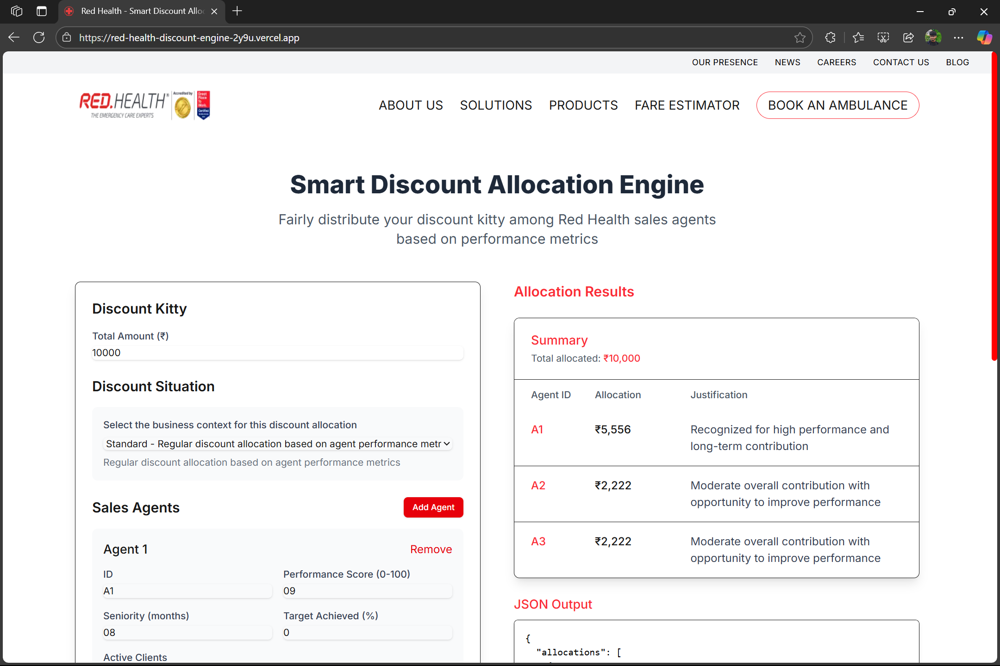
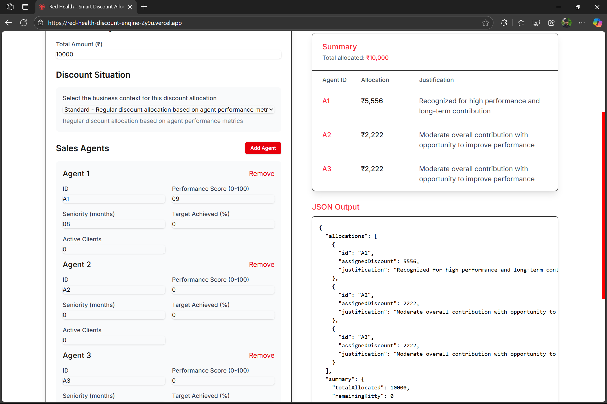

Web Checkout: https://red-health-discount-engine-2y9u.vercel.app/




# Smart Discount Allocation Engine

A Next.js application that fairly distributes a discount kitty among sales agents based on their performance metrics. This tool provides a data-driven and justifiable approach to allocating discounts, ensuring fairness and transparency.

## Features

- **Fair Allocation**: Distributes discounts based on multiple performance metrics
- **Configurable Weights**: Customize the importance of different metrics
- **Min/Max Constraints**: Set minimum and maximum allocation per agent
- **Detailed Justifications**: Provides explanations for each allocation
- **Responsive UI**: Works on desktop and mobile devices

## Approach

The discount allocation engine uses a weighted scoring system that considers multiple factors:

1. **Normalization**: All metrics are normalized to a 0-1 scale to ensure fair comparison
2. **Weighted Scoring**: Each metric is weighted based on its importance
3. **Proportional Allocation**: The kitty is distributed proportionally to each agent's score
4. **Rounding Adjustment**: Ensures the total allocated amount matches the kitty exactly
5. **Justification Generation**: Creates human-readable explanations for each allocation

### Metrics Used

- **Performance Score**: Overall performance rating (0-100)
- **Seniority**: Number of months with the company
- **Target Achievement**: Percentage of sales targets achieved
- **Active Clients**: Number of clients currently managed

## Assumptions

- All metrics are positive indicators (higher is better)
- The discount kitty is a positive number
- Each agent must have a unique ID
- Default weights can be overridden by the user
- Rounding differences are allocated to the highest performers first

## Edge Cases Handled

- **All-Same Scores**: When all agents have identical metrics, the allocation is equal
- **Rounding Issues**: Ensures the total allocated amount matches the kitty exactly
- **Min/Max Constraints**: Respects minimum and maximum allocation limits
- **Weight Validation**: Warns users if weights don't sum to 1

## Running the Application

### Prerequisites

- Node.js 18.x or higher
- npm or yarn

### Installation

1. Clone the repository
   ```bash
   git clone https://github.com/yourusername/red-health-discount-engine.git
   cd red-health-discount-engine
   ```

2. Install dependencies
   ```bash
   npm install
   # or
   yarn install
   ```

3. Start the development server
   ```bash
   npm run dev
   # or
   yarn dev
   ```

4. Open [http://localhost:3000](http://localhost:3000) in your browser

## API Usage

The application provides a REST API endpoint for programmatic access:

### POST /api/allocate

**Request Body:**

```json
{
  "siteKitty": 10000,
  "salesAgents": [
    {
      "id": "A1",
      "performanceScore": 90,
      "seniorityMonths": 18,
      "targetAchievedPercent": 85,
      "activeClients": 12
    },
    {
      "id": "A2",
      "performanceScore": 70,
      "seniorityMonths": 6,
      "targetAchievedPercent": 60,
      "activeClients": 8
    }
  ],
  "config": {
    "minPerAgent": 1000,
    "maxPerAgent": 8000,
    "weights": {
      "performanceScore": 0.35,
      "seniorityMonths": 0.25,
      "targetAchievedPercent": 0.25,
      "activeClients": 0.15
    }
  }
}
```

**Response:**

```json
{
  "allocations": [
    {
      "id": "A1",
      "assignedDiscount": 6000,
      "justification": "Recognized for high performance and long-term contribution"
    },
    {
      "id": "A2",
      "assignedDiscount": 4000,
      "justification": "Moderate overall contribution with opportunity to improve target achievement"
    }
  ],
  "summary": {
    "totalAllocated": 10000,
    "remainingKitty": 0
  }
}
```

## Testing

The application includes unit tests for the allocation engine. To run the tests:

```bash
npm test
# or
yarn test
```

